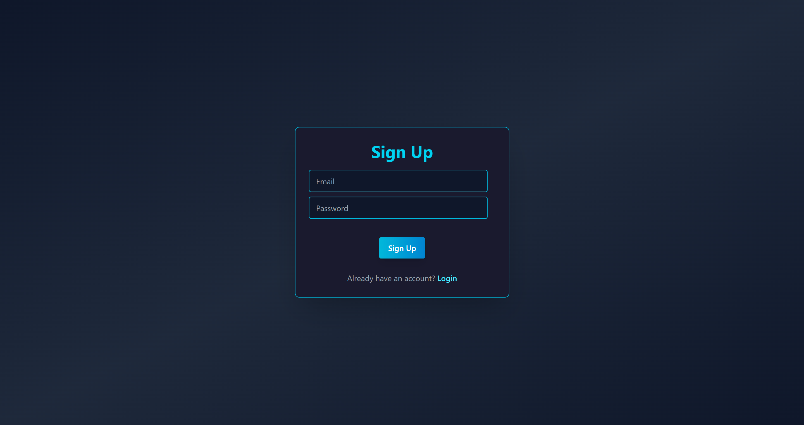
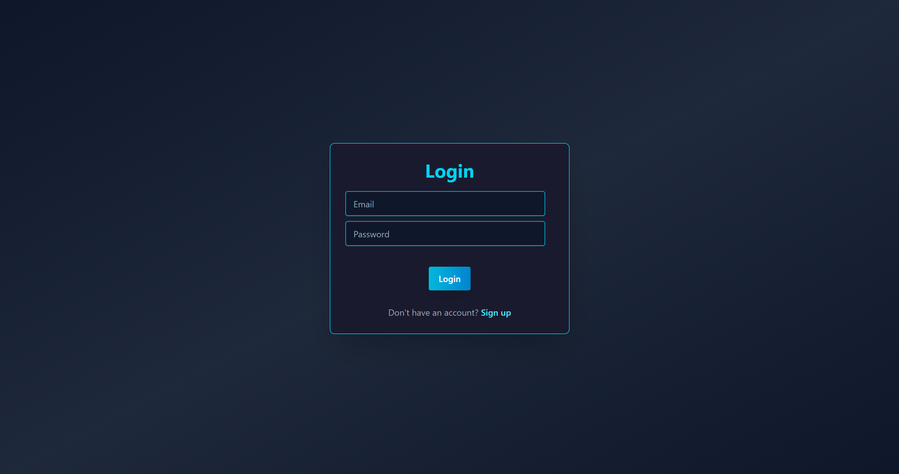
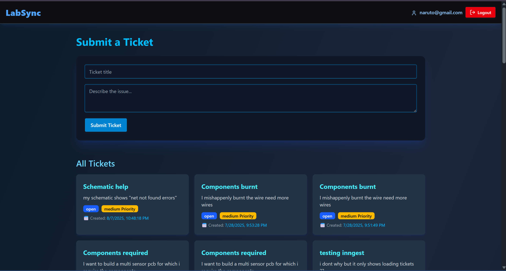
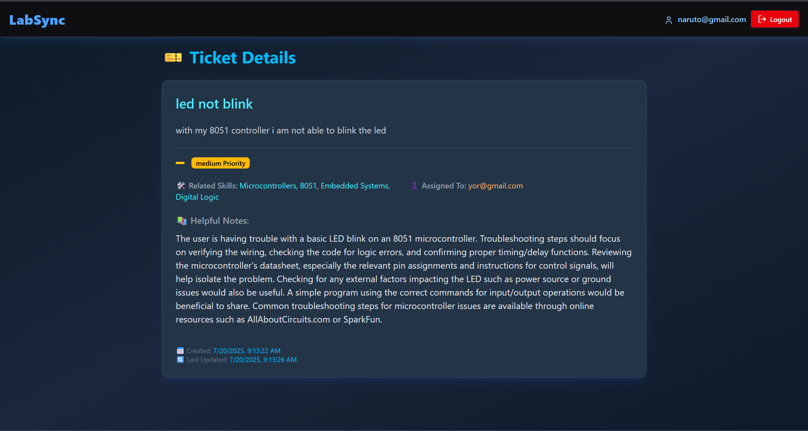
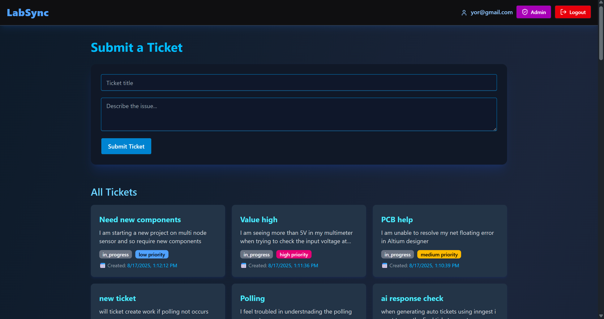
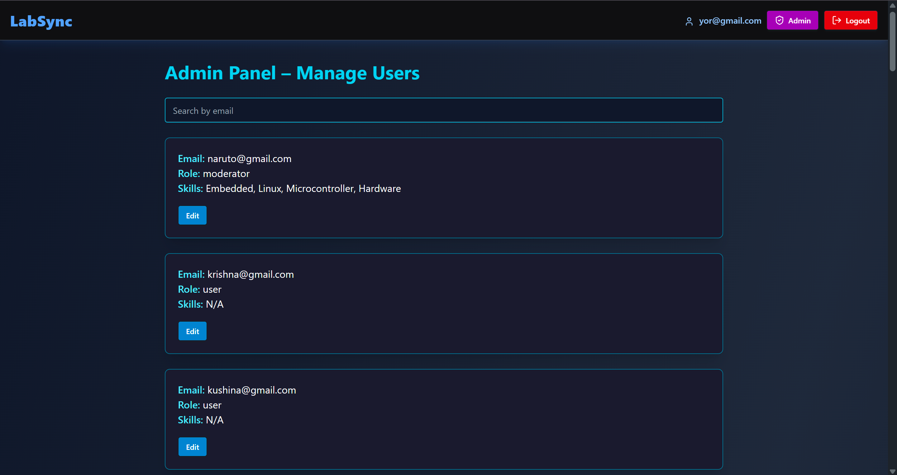

# LabSync: AI-Streamlined Lab Support  
**July 2025 Project**

> A smart lab support platform that automates ticket handling and TA allocation using AI and asynchronous workflows.

---

## Overview

LabSync is an AI-powered support system designed to streamline the management of lab-related queries in academic settings. It intelligently routes tickets, assigns priorities, and automates TA allocation—enhancing lab efficiency by over **60%**.

---

## Tech Stack

- **Frontend:** React.js  
- **Backend:** Node.js, Express.js  
- **Database:** MongoDB  
- **AI Integration:** Gemini API  
- **Automation:** Inngest  

---

## Key Highlights

- **AI-Powered Ticket Handling**  
  Utilized Gemini API to summarize lab tickets, tag relevant skills, assign urgency levels, and estimate deadlines.

- **Automated Task Routing with Inngest**  
  Implemented event-driven asynchronous workflows to assign TAs and manage ticket resolution seamlessly.

- **Efficiency Boost**  
  Achieved a **60% improvement** in query resolution time by removing manual bottlenecks.

---

## Screenshots: UI Preview

| Signup | Login |
|--------|-------|
|  |  |

| Ticket Submission | AI Summary + TA Assignment |
|-------------------|-----------------------------|
|  |  |

| Admin User View | Admins Page |
|----------------|-------------|
|  |  |

